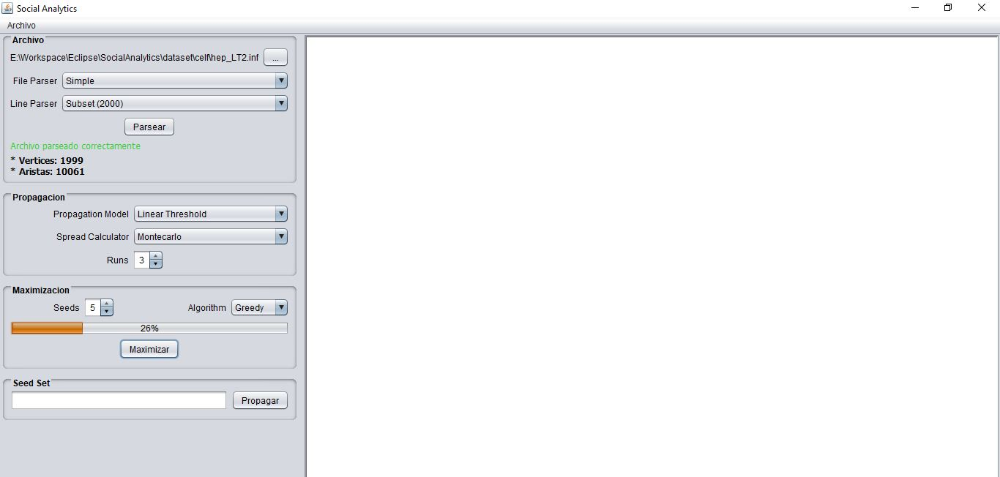
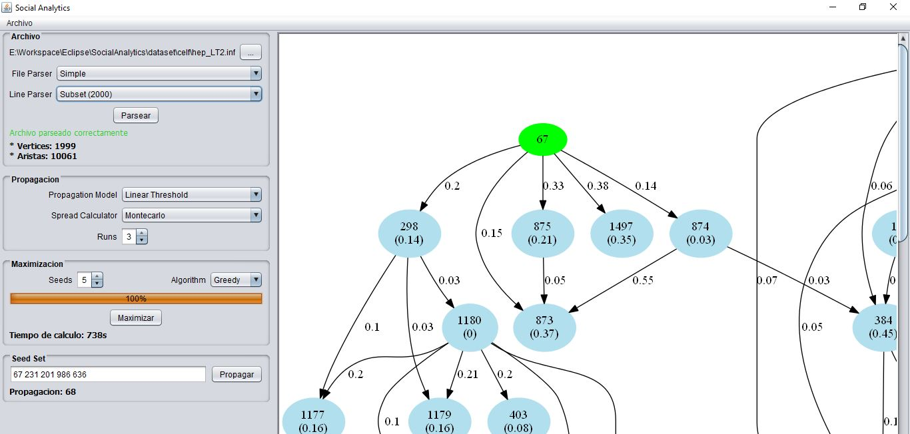

# SocialAnalytics

El proyecto tiene como objetivo el analisis de influencia en Redes Sociales. Esto consiste de encontrar los nodos (personas) más influyentes basado en la información que se obtiene de la interacción entre ellos.

La aplicación permite cargar datasets con información obtenida de diferentes redes sociales. 
Soporta los dos modelos de propagación más conocidos, **Linear Threshold (LT)**, **Independent Cascade (IC)**. 
Se implementaron cuatro algoritmos diferentes para permitir el análisis y la comparación entre ellos:
- Random
- Greedy
- CELF
- CELF++

Una vez ejecutado el algoritmo y obtenidos los nodos más influyentes, la aplicación genera un gráfico con el árbol completo de influencia

## Desarrollo

La aplicación fue desarrollada como trabajo final de la materia Diseño de Sistemas para la carrera de Ingenieria de Sistemas de la UNCPBA en el año 2016
